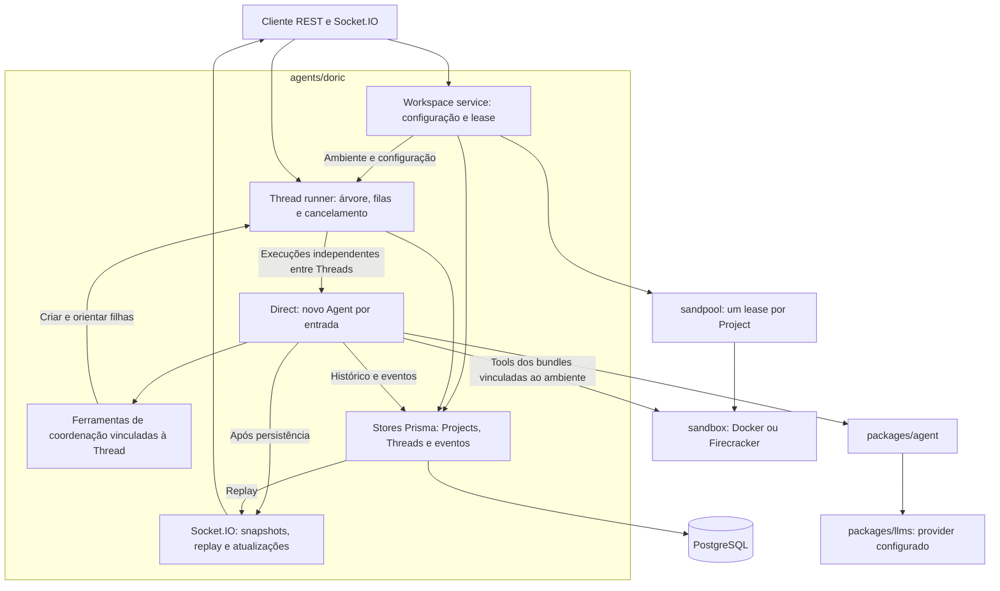
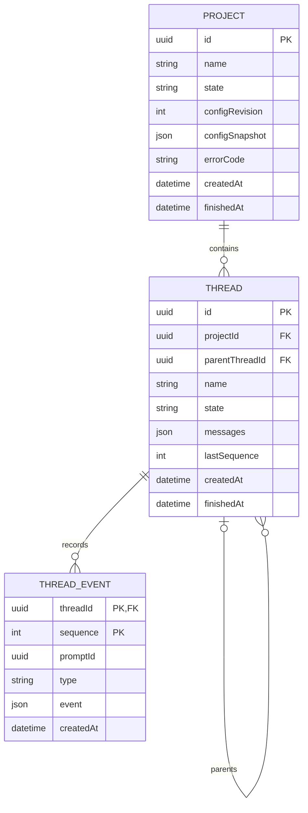
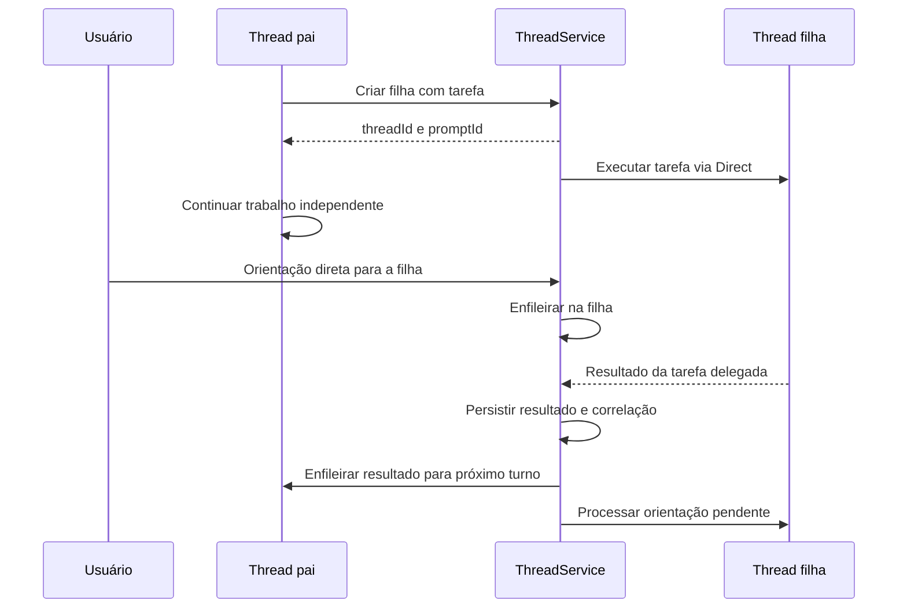

# Doric: Projects, Threads e subagentes

Status: implementado na branch `feat/threads`; validação registrada na seção 10.

Este documento consolida as decisões da conversa sobre Projects e Threads.
Todas as decisões, inclusive interrupção, encerramento em cascata e entrega
automática de resultados, foram aprovadas. O texto define o contrato da
implementação, não uma lista de alternativas pendentes. O cutover aprovado
usa uma baseline limpa de Project/Thread, sem migração de dados de Session.
Nenhum banco de implantação foi alterado automaticamente.

## 1. Decisões confirmadas

- **Project** assume a antiga responsabilidade de ambiente da Session: uma
  instância autocontida de Docker ou Firecracker.
- **Thread** é uma conversa com o agente, com histórico e fila próprios.
- Uma Thread pode ter filhas, e estas também podem ter filhas.
- **Subagente** é o agente atuando em uma Thread filha sob coordenação do pai;
  não é uma entidade de execução diferente.
- O usuário pode conversar diretamente em qualquer Thread ativa, inclusive
  filhas criadas por agentes. O parentesco não concede controle exclusivo ao pai.
- O agente pai pode criar, consultar e orientar suas Threads filhas.
- Todas as Threads usam a arquitetura Direct: um Agent novo por entrada
  executada, recuperando o histórico daquela Thread.
- Threads distintas executam em paralelo, sem limite de quantidade de Threads
  ou de execuções simultâneas imposto pelo Doric, globalmente ou por Project.
- Dentro de uma Thread, as entradas continuam serializadas.
- As Threads compartilham o sandbox do Project. Não há sandbox, branch ou
  worktree Git criado automaticamente por Thread.
- A migração substitui APIs e clientes de Session sem suporte legado, aliases
  ou adaptadores de compatibilidade.
- Criar Project e criar Thread são operações separadas. Novos Projects nascem
  sem Threads.
- O cutover remove migrações e conversão de dados de Session. Uma baseline
  cria o schema atual a partir de banco vazio. Bancos legados exigem recriação
  explícita pelo operador; não há reset automático.

Sem limite de concorrência no Doric não significa recursos ilimitados:
CPU, memória e disco continuam compartilhados, e providers podem impor quotas.
O limite atual do pool continua limitando Projects, não Threads.

## 2. Base existente e divisão de responsabilidades

O host separa as responsabilidades nos módulos
[`workspace/service.ts`](../../agents/doric/src/lib/workspace/service.ts)
(Projects, árvore, lease e encerramento),
[`workspace/runner.ts`](../../agents/doric/src/lib/workspace/runner.ts)
(fila e execução por Thread),
[`agents/direct/executor.ts`](../../agents/doric/src/lib/agents/direct/executor.ts)
(Agent por entrada) e
[`agents/direct/tools/index.ts`](../../agents/doric/src/lib/agents/direct/tools/index.ts)
(ferramentas vinculadas ao pai). Os contratos estão em
[`workspace/types.ts`](../../agents/doric/src/lib/workspace/types.ts) e
[`workspace/coordination.ts`](../../agents/doric/src/lib/workspace/coordination.ts).
Persistência, rotas e replay migram para Project e Thread no mesmo escopo.

| Responsabilidade antes concentrada na Session   | Responsável                           |
| ----------------------------------------------- | ------------------------------------- |
| Aquisição, SSH e liberação do sandbox           | Project                               |
| Snapshot da configuração e geração de providers | Project                               |
| Histórico pronto para o provider                | Thread                                |
| Fila FIFO e execução do prompt                  | Thread                                |
| Eventos ordenados e replay                      | Thread                                |
| Identificação de uma execução por promptId      | Mantida dentro da Thread              |
| Encerramento do ambiente                        | Project, com cancelamento das Threads |

O host continua em `agents/doric`. Não há necessidade inicial de novos pacotes,
workers, processos, brokers ou um serviço distribuído. `packages/agent`
continua sem conhecer Projects, Threads, Prisma ou Socket.IO.
`packages/session` é um store genérico em memória, não a implementação das
sessões Direct; não deve ser ampliado apenas por compartilhar o nome antigo.

## 3. Arquitetura de implementação

Cada Thread possui seu loop local e sua fila, sem semáforo compartilhado de
execução. A aquisição do sandbox é compartilhada: Threads aguardam o Project
ficar pronto, mas não adquirem leases individuais. Nenhuma fila global de
Threads deve ser introduzida disfarçada de controle de capacidade.

## 4. Contrato de persistência

Esboço conceitual, não schema Prisma definitivo. A chave dos eventos continua
composta por Thread e sequência.

Regras aprovadas:

- Pai e filha pertencem ao mesmo Project. Parentesco imutável na primeira
  versão, validado também na persistência, impede ciclos e reparenting.
- Projects e Threads têm nomes persistidos, aparados, sem NUL e com 1 a 80
  caracteres Unicode. Criação exige nome; rename preserva identidade e estado.
- Um Project pode receber uma cor de uma paleta fixa do host; atribuir ou
  limpar a cor não altera nome, identidade nem lifecycle.
- Não há campo de controlador exclusivo nem tabelas Agent/Subagent.
- Cada Thread mantém seu próprio histórico. Filhas recebem tarefa e contexto
  explícitos, sem cópia automática do histórico inteiro do pai.
- A configuração capturada pelo Project é usada por suas Threads. Trocar
  `/config` afeta novos Projects; overrides de modelo por Thread ficam fora
  da primeira versão.
- Entradas registram origem: usuário, Thread pai ou resultado de delegação.
  Identidade do emissor é estabelecida pelo host, nunca confiada ao modelo.
- A correlação da delegação inclui Thread e prompt de origem, Thread e prompt
  de destino. Metadados ficam nos eventos; uma tabela de jobs não é requisito
  para introduzir a hierarquia.
- Histórico e eventos são duráveis; filas e execuções continuam locais e sem
  retomada automática após restart, como hoje. Persistir aceitação não promete
  executar o trabalho após uma queda.

## 5. Interação humana e delegação

Usuário e pai enviam entradas pela mesma fronteira de aceitação da Thread.
O FIFO é definido pela ordem de aceitação serializada no host, não pelo horário
em que clientes independentes iniciaram suas requisições.

Enviar uma orientação não interrompe a chamada ao provider em andamento.
Entradas novas aguardam a execução atual terminar; um comando de interrupção
é uma operação diferente.

Conclusão, falha ou cancelamento de um pedido delegado gera uma
notificação correlacionada ao pai. O host não altera mensagens durante uma
execução ativa. Pai ready é ativado automaticamente pela entrada de resultado; pai
ocupado a processa após o turno atual. Sem interrupção explícita, uma execução
longa também atrasa a leitura dessas notificações.

Uma resposta a uma conversa posterior iniciada pelo usuário não é enviada
automaticamente ao pai como resultado de delegação. Resultados não geram
respostas automáticas de volta à filha, evitando ciclos de notificações.
Deduplicação usa a identidade do pedido delegado; não promete entrega
exatamente uma vez através de quedas do processo. Resultado destinado a pai
encerrado permanece consultável na filha, sem reabrir o pai.

## 6. Ferramentas de coordenação

| Ferramenta         | Contrato                                                                    |
| ------------------ | --------------------------------------------------------------------------- |
| `spawn_thread`     | Cria filha e aceita tarefa inicial; retorna sem aguardar execução           |
| `list_threads`     | Lista filhas e estados, com paginação sem limitar quantidade total          |
| `get_thread`       | Consulta estado, progresso e resultado autorizado                           |
| `send_to_thread`   | Enfileira orientação na filha e retorna promptId                            |
| `interrupt_thread` | Interrompe somente o promptId ativo identificado, preservando fila e filhas |
| `terminate_thread` | Encerra a filha e sua subárvore                                             |

Essas ferramentas usam `packages/tool`, mas são montadas no host, pois precisam
do serviço de Threads, não apenas do sandbox. Tools de filesystem, Git e terminal
continuam vindo dos bundles existentes.

Project e Thread chamadora são bindings do host. O modelo só fornece o destino
permitido e o conteúdo. Inicialmente, ferramentas de controle atuam sobre filhas
diretas; cancelamento da subárvore é uma operação do serviço. Não há acesso
arbitrário a outros Projects, ancestrais ou Threads irmãs.

Não introduzir limite de quantidade, profundidade ou concorrência nas ferramentas.
Os limites existentes de turnos por execução e recursos do sandbox permanecem.

## 7. Ciclo de vida e segurança

Project: `queued -> ready -> cancelling -> cancelled`, com `failed` para falhas
terminais. Não precisa de estado running: várias Threads podem estar executando.

Thread: `queued` enquanto aguarda ambiente; depois `ready -> running -> ready`.
Falha de um prompt produz evento e normalmente retorna a ready. Encerramento
usa `cancelling -> cancelled`; falha terminal de infraestrutura usa failed.

- Concluir uma tarefa não encerra a Thread. Usuário e pai podem continuar o chat.
- Interromper uma execução preserva Thread, histórico parcial e fila posterior.
  Exige o promptId ativo; pedido atrasado não cancela a próxima execução.
  Não interrompe filhas nessa operação; encerramento é que cascata.
- Encerrar Thread bloqueia novas entradas e novas filhas na subárvore antes de
  cancelar trabalhos ativos e pendentes. Irmãs e pai continuam independentes.
- Encerrar Project bloqueia novas Threads e entradas, cancela todas as
  execuções, aguarda sua finalização e só então libera o lease uma vez.
- No restart, Projects e Threads não terminais viram failed com indicação de
  interrupção. Não se reconectam automaticamente a sandboxes antigos.
- Não há expiração automática de Projects ociosos.
- Exclusão física requer estado terminal. Excluir Thread com sua subárvore
  exige que toda ela seja terminal; Project exige todas terminais.
- Não há isolamento de arquivos ou processos entre Threads. Edições simultâneas
  podem conflitar; o host não deve prometer merge ou rollback automático.
- Preservar redaction de credenciais, privacidade de SSH e persistência antes da
  publicação. Tool arguments nunca recebem chaves ou identidade privilegiada.
- O host atual não tem autenticação nas rotas. Este plano não cria uma fronteira
  multiusuário segura: mantém a exigência de rede confiável e isolada.

## 8. API e eventos

| Superfície                | Operações                                 |
| ------------------------- | ----------------------------------------- |
| `/projects`               | Criar e listar Projects                   |
| `/projects/:id`           | Consultar, renomear e excluir Project     |
| `/projects/:id/color`     | Atribuir ou limpar a cor do Project       |
| `/projects/:id/terminate` | Encerrar Project                          |
| `/projects/:id/ssh`       | Consultar acesso efêmero do sandbox       |
| `/projects/:id/threads`   | Criar e listar Threads do Project         |
| `/threads/:id`            | Consultar, renomear e excluir Thread      |
| `/threads/:id/prompt`     | Aceitar entrada humana                    |
| `/threads/:id/events`     | Replay exclusivo após afterSequence       |
| `/threads/:id/interrupt`  | Interromper o promptId ativo identificado |
| `/threads/:id/terminate`  | Encerrar Thread e subárvore               |

Excluir Project terminal usa `DELETE /projects/:id`. Criação de Project e
Thread exige um nome; `PATCH` renomeia sem alterar o lifecycle, e
`PATCH /projects/:id/color` atribui ou limpa a cor do Project. O corpo de
criação de Thread pode indicar um pai pertencente ao mesmo Project. Uma rota
pública não deve aceitar origem privilegiada arbitrária no corpo.

Socket.IO: namespace `/threads` para snapshot, eventos e atualizações
por Thread; namespace `/projects` para estado do ambiente e atualizações da
árvore. Histórico de execução tem sequência por Thread, não uma ordem global
entre Threads. Reconexão da visão de Project refaz seu snapshot e listagem.

Eventos de Thread carregam projectId, threadId, promptId, sequence, type,
event e createdAt. Reaproveitar o padrão atual de inscrição antes do replay,
buffer de eventos ao vivo e deduplicação por sequência.
VM/SSH passa a referenciar Project em vez de Session.

## 9. Plano de implementação

### Fase 1: aplicar contratos aprovados e migração

- Substituir `/sessions`, seu namespace Socket.IO e contratos de clientes
  pelos novos recursos, sem camada de compatibilidade.
- Gerar baseline versionada com Prisma `migrate diff --from-empty`, mantendo
  a proteção de parentesco imutável e acíclico em um trigger explícito.
- Remover a cadeia de migrações de Session e a conversão de dados antigos,
  conforme o cutover aprovado.
- Manter aplicação da baseline fora do startup HTTP e validar em banco vazio.
  Bancos legados não são atualizados em lugar nem resetados automaticamente.

### Fase 2: separar ambiente e conversa

- Separar gestão de Projects e stores no host, movendo lease, geração e SSH.
- Separar execução de Threads e stores, movendo histórico, FIFO e eventos.
- Adaptar Direct para receber Project, Thread e prompt sem alterar o núcleo.
- Configurar um loop independente por Thread, sem teto global ou por Project.
- Separar cancelamento de Project, Thread e execução atual.

### Fase 3: expor múltiplas conversas

- Implementar rotas e Socket.IO novos.
- Criar Projects sem conversa implícita; expor criação de Threads como uma
  operação independente.
- Permitir criar raízes e filhas, conversar e acompanhar qualquer Thread ativa.
- Implementar integridade do parentesco, paginação e exclusão terminal.
- Migrar associação VM/SSH e manter o tratamento privado das chaves.

### Fase 4: delegar pelo agente

- Injetar ferramentas de coordenação no Direct.
- Registrar origem e correlação de entradas sem misturar históricos.
- Enfileirar resultados para o pai sem bloquear filhos ou alterar execução ativa.
- Tratar criação, envio e cancelamento concorrentes, impedindo novos
  descendentes após o início do encerramento.

### Fase 5: validar e atualizar contratos

- Exercitar os critérios abaixo pelos serviços públicos e APIs.
- Executar os targets Nx aplicáveis: `npx nx show projects`,
  `npx nx run doric:test` e `npx nx run doric:build`.
- Executar migração e fluxos HTTP/Socket.IO em ambiente controlado; validar
  integração real com cada provider de sandbox afetado.
- Atualizar GROUNDING, documentação de API e instruções operacionais para
  descrever o runtime implementado, removendo a distinção de arquitetura futura.

## 10. Validação e critérios comportamentais de aceitação

Evidências da implementação:

- `nx show projects`, `nx run doric:build` e `nx run agent:typecheck` passaram.
- `nx run agent:test`: 104 testes passaram.
- `nx run doric:test`, com `DORIC_TEST_DATABASE_URL` e
  `DORIC_TEST_SANDBOX=true`: 100 testes passaram, sem skips. Inclui baseline
  limpa em PostgreSQL 18.4 e fluxo composto HTTP/Socket.IO, Direct,
  ferramentas dos bundles e sandbox Docker real.
- A baseline foi aplicada com `nx run doric:migrate` em banco vazio; uma
  segunda execução não encontrou migrações pendentes. Prisma `migrate diff`
  confirmou ausência de diferenças entre o banco instalado e o schema.
- `node --test scripts/tests/spawn-agent.test.mjs`: 7 testes passaram.
- O fluxo composto delega para uma filha, grava um arquivo, retoma o pai,
  verifica o mesmo arquivo em outra raiz, conversa diretamente na filha,
  confirma históricos separados e encerra/exclui o Project.
- Somente a fronteira externa do LLM foi substituída por respostas
  determinísticas; não houve chamadas pagas nem envio de código a providers.
- Os recursos descartáveis de teste foram removidos. Firecracker foi compilado
  como dependência, mas não executado neste host macOS; a integração real
  Firecracker/KVM requer Linux x86_64.

Os comandos Nx usaram `NX_DAEMON=false`, `NX_ISOLATE_PLUGINS=false` e
`NX_NATIVE_COMMAND_RUNNER=false` para contornar o limite de tamanho de
sockets Unix no caminho longo do worktree. Nenhum alvo foi substituído por
um resultado simulado. Prettier e `git diff --check` também passaram.

Após a revisão behavioral-testing, os testes passaram a distinguir FIFO de
LIFO, exercer controles autorizados de filhas, verificar histórico completo
de recuperação, reconciliação de todos os estados e cleanup em falhas de
preparação. HTTP e integração usam o mesmo registro de rotas da produção.
Mutações em cópias temporárias comprovaram a detecção de fila invertida,
controles sempre rejeitados, histórico órfão, callback não aguardado,
recuperação de stream ausente, erro de persistência tratado como recuperável,
alias legado e dependência de formatação incidental no provider de teste.

A reorganização de `src/lib` preservou os corpos dos módulos compartilhados,
alterando apenas seus imports. O prompt base em `agents/direct/prompts/system.ts`
exporta uma única constante literal; a composição de skills mantém o texto
anterior. Comparações com a versão anterior confirmaram igualdade do prompt e
dos nomes, ordem, descrições e schemas das seis tools individualizadas.

Seguir a skill behavioral-testing. Verificar contratos públicos, não nomes de
helpers, coleções internas ou detalhes de chamadas entre módulos.

| Cenário                                   | Evidência esperada                                                                                                                                                |
| ----------------------------------------- | ----------------------------------------------------------------------------------------------------------------------------------------------------------------- |
| Duas Threads com trabalho pendente        | Ambas iniciam antes de uma delas concluir; provar com barreiras controladas, não sleeps                                                                           |
| Várias Threads no mesmo Project           | Todas podem iniciar sem consumir novos leases ou aguardar vagas de Thread                                                                                         |
| Duas entradas na mesma Thread             | Execução serial e segunda entrada observa histórico da primeira                                                                                                   |
| Usuário escreve em subagente ocupado      | Entrada é aceita, preserva origem e executa depois                                                                                                                |
| Pai envia instrução à filha               | Mesmo contrato de fila; nenhuma mutação fora do histórico da filha                                                                                                |
| Filha conclui, falha ou cancela delegação | Resultado correlacionado chega ao pai uma vez no fluxo normal; ready executa automaticamente, running respeita FIFO, sem encaminhar conversas humanas posteriores |
| Pai termina antes da filha responder      | Não é reaberto por notificação tardia                                                                                                                             |
| Criação de filha durante encerramento     | Rejeitada; nenhuma execução escapa da subárvore cancelada                                                                                                         |
| Interrupção de um prompt                  | Fila pendente continua após cancelamento cooperativo; filhas seguem ativas; promptId atrasado não cancela o próximo prompt                                        |
| Encerramento de Project                   | Nenhuma execução segue usando sandbox após sua liberação                                                                                                          |
| Destino fora do escopo da ferramenta      | Operação rejeitada sem leitura ou efeito em outra árvore                                                                                                          |
| Reconexão durante publicação              | Replay ordenado sem lacunas ou duplicação na transição ao vivo                                                                                                    |
| Restart                                   | Histórico consultável; execuções não retomadas; estados reconciliados                                                                                             |
| Instalação limpa após cutover             | Banco vazio recebe apenas o schema atual, sem tabelas nem dados de Session                                                                                        |

## 11. Contratos de controle aprovados

Não há decisões pendentes neste escopo. A implementação solicitada inclui
migração sem suporte legado, criação separada de Project e Thread e todos os
contratos de controle abaixo.

### Interromper uma execução

- Solicitar cancelamento do prompt identificado, sem encerrar a Thread.
  Usar promptId evita que um pedido atrasado interrompa a próxima execução.
- Preservar histórico parcial e registrar a interrupção. Não desfazer edições,
  efeitos externos ou processos destacados automaticamente.
- Aguardar a execução ativa finalizar antes de processar outra entrada.
  Cancelamento é cooperativo, não garantia de parada instantânea.
- Manter entradas pendentes na fila e continuar seu processamento. Isso não
  equivale a pausar a Thread nem a limpar sua fila.
- Não interromper filhas. Para parar a árvore, usar encerramento.

### Encerrar uma Thread

- Tornar a Thread e sua subárvore inativas: rejeitar novas entradas e filhas,
  cancelar execução ativa e descartar trabalho pendente com registro de
  cancelamento.
- Preservar histórico e eventos para consulta; excluir é outra operação.
- Manter pai, irmãs e outras raízes funcionando. O sandbox pertence ao Project
  e não é liberado quando uma Thread é encerrada.
- Concluir o prompt do pai não encerra sua Thread nem suas filhas.
- A cascata faz parte do contrato: filhas não sobrevivem ao encerramento da
  Thread pai.

### Entregar resultados ao pai

- Conclusão, falha ou cancelamento de pedido delegado gera resultado
  correlacionado. Isso não inclui automaticamente cada mensagem da filha.
- Se o pai estiver ready, a entrada inicia automaticamente uma nova execução Direct,
  consumindo tokens e podendo usar ferramentas como qualquer outro prompt.
- Se estiver running, a entrada aguarda na fila até a execução atual terminar;
  não injeta contexto no meio de uma chamada nem interrompe trabalho.
- Se estiver terminal, apenas preservar o resultado consultável na filha.
- Conversas humanas posteriores continuam independentes. Uma resposta sem
  pedido delegado associado não dispara trabalho no pai.
- A entrega automática permite que o agente coordenador consolide os resultados
  sem intervenção humana; não depende de consulta ou prompt manual do usuário.

Retomada durável de jobs, autenticação multiusuário, isolamento por Thread,
overrides de modelo e distribuição entre hosts ficam fora da primeira versão.
